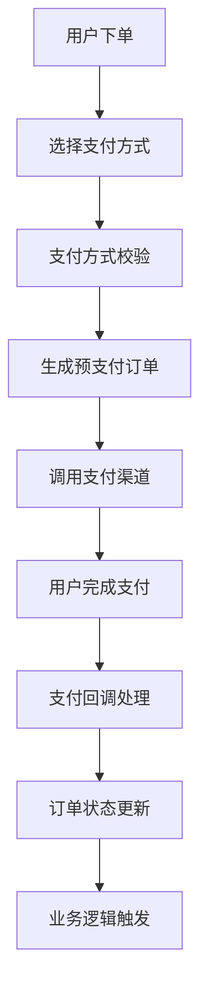

# Test.lovexstory.com 项目架构与系统分析

## 项目概览

### 项目定位
- **项目类型**: 在线教育/课程销售平台
- **业务模式**: 课程付费购买 + 分销返佣
- **技术架构**: 前后端分离 + 多端适配
- **核心价值**: 知识付费 + 社交分销

### 技术架构图
```
┌─────────────────┬─────────────────┬─────────────────┐
│   管理后台      │    移动端       │    后端服务     │
│  (admin/)       │  (uniapp/)      │   (server/)     │
│                 │                 │                 │
│ Vue3 + TS       │ UniApp + TS     │ ThinkPHP 6.0    │
│ Element Plus    │ Vue3            │ PHP 8.0+        │
│ Pinia           │ Pinia           │ MySQL 5.7+      │
└─────────────────┴─────────────────┴─────────────────┘
```

---

## 用户系统架构深度分析

### 1. 用户体系设计

#### 1.1 用户类型
```php
// 用户角色分类
├── 管理员 (ls_admin)
│   ├── 超级管理员
│   ├── 普通管理员  
│   └── 客服人员
│
└── 前端用户 (ls_user)
    ├── 普通学员
    ├── 分销商
    └── 讲师
```

#### 1.2 用户数据模型
```sql
-- 核心用户表 (ls_user)
用户ID (id)                    -- 主键
用户编号 (sn)                  -- 业务编号，用于分享等
昵称 (nickname)                -- 显示名称
头像 (avatar)                  -- 头像URL
真实姓名 (real_name)           -- 实名信息
手机号 (mobile)                -- 登录凭证
性别 (sex)                     -- 用户画像
注册渠道 (channel)             -- 渠道统计
账户余额 (user_money)          -- 可消费金额
可提现佣金 (user_earnings)     -- 分销收益
账号 (account)                 -- 登录账号
密码 (password)                -- 加密存储
登录信息 (login_time/login_ip) -- 安全追踪
状态控制 (is_disable)          -- 账号开关
新用户标识 (is_new_user)       -- 营销标记
分销关系 (first_leader/second_leader) -- 上下级关系
```

#### 1.3 分销关系设计
```
┌─────────────┐
│  一级分销商  │ ← first_leader
└─────────────┘
       ↓
┌─────────────┐
│  二级分销商  │ ← second_leader  
└─────────────┘
       ↓
┌─────────────┐
│   普通用户   │
└─────────────┘

特点：
- 最多两级分销关系
- 支持佣金分润算法
- 动态等级升级机制
```

### 2. 认证授权系统

#### 2.1 多端登录支持
```php
// 支持的登录方式
class LoginMethods {
    // 账号密码登录
    const ACCOUNT_PASSWORD = 1;
    
    // 手机验证码登录  
    const MOBILE_SMS = 2;
    
    // 微信登录系列
    const WECHAT_MINIPROGRAM = 3;  // 小程序
    const WECHAT_OFFICIAL = 4;     // 公众号
    const WECHAT_APP = 5;          // APP微信
}
```

#### 2.2 Token机制设计
```php
// Token生命周期管理
class TokenLifecycle {
    生成Token → 存储会话 → 缓存用户信息 → 验证请求 → 延期Token → 清理过期
    
    特性：
    - 单终端单Token (防止多设备登录)
    - Redis缓存加速验证
    - 自动延期机制
    - 安全过期清理
}
```

#### 2.3 用户会话表设计
```sql
-- 会话管理 (ls_user_session)
用户ID (user_id)       -- 关联用户
终端类型 (terminal)     -- 设备类型标识
令牌 (token)           -- 访问凭证
更新时间 (update_time) -- 最后活跃时间
过期时间 (expire_time) -- Token失效时间

-- 授权信息 (ls_user_auth)  
用户ID (user_id)       -- 关联用户
微信OpenID (openid)    -- 微信唯一标识
微信UnionID (unionid)  -- 微信开放平台标识
终端类型 (terminal)     -- 授权来源
```

### 3. 微信生态集成

#### 3.1 微信登录矩阵
```
小程序登录 ──┐
           ├─→ WechatUserService ──→ 统一用户账号
公众号登录 ──┤
           │
APP微信登录─┘

核心逻辑：
1. 微信授权获取 code
2. 后端通过 code 获取 openid
3. openid 匹配系统用户
4. 新用户自动注册
5. 返回系统 token
```

#### 3.2 UnionID机制
```php
// 多端账号统一
if (unionid_exists) {
    // 同一微信账号，不同端登录
    // 共享用户数据，独立session
    return existing_user;
} else {
    // 创建新用户
    return create_new_user();
}
```

### 4. 安全机制

#### 4.1 密码安全
- **加盐哈希**: `password_hash()` + 随机盐
- **登录失败锁定**: 连续失败5次锁定账户
- **密码强度**: 前端验证 + 后端校验

#### 4.2 短信验证
- **验证码生成**: 6位随机数字
- **有效期控制**: 5分钟有效期
- **频率限制**: 60秒发送间隔
- **场景分类**: 注册/登录/找回密码/绑定手机

#### 4.3 Token安全
- **HTTPS传输**: 强制SSL加密
- **定期轮换**: Token自动延期机制
- **权限隔离**: 不同角色不同权限范围

---

## 支付系统架构深度分析

### 1. 支付系统设计哲学

#### 1.1 多支付方式支持
```php
// 支付方式枚举
class PaymentMethods {
    const WECHAT_PAY = 1;    // 微信支付
    const ALIPAY = 2;        // 支付宝支付  
    const BALANCE = 3;       // 余额支付
}

// 多终端适配
class TerminalSupport {
    const MINIPROGRAM = 1;   // 小程序支付
    const OFFICIAL_ACCOUNT = 2; // 公众号支付
    const H5 = 3;            // H5支付
    const APP = 4;           // APP支付
    const PC = 5;            // PC网页支付
}
```

#### 1.2 支付架构分层
```
┌─────────────────┐
│   业务层        │ ← 订单创建、优惠计算
├─────────────────┤
│   支付逻辑层    │ ← 支付方式选择、预支付
├─────────────────┤
│   支付服务层    │ ← 各支付渠道具体实现
├─────────────────┤
│   支付SDK层     │ ← 微信SDK、支付宝SDK
└─────────────────┘
```

### 2. 核心支付流程

#### 2.1 统一支付流程


#### 2.2 订单状态流转
```php
// 订单状态枚举
class OrderStatus {
    const UNPAID = 1;        // 待付款
    const COMPLETED = 2;     // 已完成
    const CLOSED = 3;        // 已关闭
}

// 支付状态枚举
class PayStatus {
    const UNPAID = 0;        // 待支付
    const PAID = 1;          // 已支付
}

// 退款状态枚举  
class RefundStatus {
    const NO_REFUND = 1;     // 未退款
    const PARTIAL_REFUND = 2; // 部分退款
    const FULL_REFUND = 3;   // 全部退款
}
```

### 3. 支付服务架构

#### 3.1 BasePayService 基础服务
```php
abstract class BasePayService {
    // 统一错误处理
    abstract protected function error($message);
    
    // 统一成功返回
    abstract protected function success($data);
    
    // 支付配置获取
    abstract protected function getConfig();
    
    // 签名验证
    abstract protected function verifySign();
}
```

#### 3.2 微信支付服务 (WeChatPayService)
```php
class WeChatPayService extends BasePayService {
    // 支付方式适配
    public function pay($order) {
        switch ($this->terminal) {
            case UserTerminalEnum::WECHAT_MMP:
                return $this->jsapiPay($order);    // 小程序支付
            case UserTerminalEnum::WECHAT_OA:  
                return $this->jsapiPay($order);    // 公众号支付
            case UserTerminalEnum::H5:
                return $this->mwebPay($order);     // H5支付
            case UserTerminalEnum::APP:
                return $this->appPay($order);      // APP支付
            case UserTerminalEnum::PC:
                return $this->pcPay($order);       // 扫码支付
        }
    }
}
```

#### 3.3 支付宝支付服务 (AliPayService)
```php
class AliPayService extends BasePayService {
    // 支付宝多端支持
    public function pay($order) {
        switch ($this->terminal) {
            case UserTerminalEnum::PC:
                return $this->pagePay($order);     // 网站支付
            case UserTerminalEnum::H5:
                return $this->wapPay($order);      // 手机网站支付  
            case UserTerminalEnum::APP:
                return $this->appPay($order);      // APP支付
        }
    }
}
```

### 4. 数据模型设计

#### 4.1 订单表结构 (ls_order)
```sql
核心字段：
- id: 订单ID
- sn: 订单编号 (业务唯一标识)
- transaction_id: 第三方支付交易号
- user_id: 购买用户
- type: 订单类型 (课程/题库/其他)
- order_status: 订单状态
- pay_status: 支付状态  
- pay_way: 支付方式
- pay_time: 支付时间
- order_amount: 订单金额
- refund_status: 退款状态
- coupon_list_id: 使用的优惠券
- discount_amount: 优惠金额

业务字段：
- course_id: 关联课程
- course_name: 课程名称
- course_image: 课程图片
- course_price: 课程价格
```

#### 4.2 支付配置表 (ls_dev_pay)
```sql
配置结构：
- id: 配置ID
- name: 支付方式名称
- pay_way: 支付类型 (1微信/2支付宝/3余额)
- config: JSON配置 (存储密钥等敏感信息)
- image: 支付图标
- sort: 显示排序

微信支付配置示例：
{
  "interface_version": "v2",
  "merchant_type": "ordinary_merchant", 
  "mch_id": "商户号",
  "pay_sign_key": "API密钥",
  "apiclient_cert": "证书内容",
  "apiclient_key": "证书密钥"
}

支付宝配置示例：
{
  "pattern": "normal_mode",
  "merchant_type": "ordinary_merchant",
  "app_id": "应用ID", 
  "private_key": "应用私钥",
  "ali_public_key": "支付宝公钥"
}
```

#### 4.3 支付方式开关表 (ls_dev_pay_way)
```sql
控制逻辑：
- scene: 使用场景 (1小程序/2公众号/3H5/4PC/5APP)
- pay_id: 关联支付配置
- is_default: 是否默认支付方式
- status: 启用状态

功能特点：
- 细粒度控制：每个端可以独立配置支付方式
- 默认支付：提升用户体验
- 动态开关：运营活动支持
```

### 5. 回调处理机制

#### 5.1 统一回调处理 (PayNotifyLogic)
```php
class PayNotifyLogic {
    // 统一回调入口
    public static function handle($payWay, $outTradeNo, $transactionId, $totalAmount) {
        // 1. 验证订单存在性
        // 2. 检查订单状态
        // 3. 验证金额匹配
        // 4. 更新订单状态
        // 5. 触发业务逻辑
        // 6. 记录支付日志
    }
}
```

#### 5.2 业务触发机制
```php
// 支付成功后触发的业务逻辑
支付成功 → 订单完成 → 课程权限开通 → 分销佣金计算 → 用户消息通知
```

### 6. 安全机制

#### 6.1 支付安全
- **金额校验**: 服务端二次验证金额
- **订单幂等**: 重复回调处理机制
- **签名验证**: 所有回调必须验证签名
- **HTTPS通信**: 强制加密传输

#### 6.2 配置安全  
- **敏感信息加密**: 数据库存储加密
- **权限控制**: 只有超管可以修改支付配置
- **审计日志**: 配置变更记录

---

## 订单系统分析

### 1. 订单类型体系
```php
// 订单类型分类
class OrderTypes {
    const COURSE_ORDER = 1;      // 课程订单
    const QUESTION_BANK_ORDER = 2; // 题库订单
    // 可扩展其他类型
}
```

### 2. 订单生命周期
```
创建订单 → 选择支付 → 完成支付 → 权限开通 → 订单完成
   ↓
支付超时 → 订单关闭
   ↓  
申请退款 → 退款处理 → 权限回收
```

### 3. 优惠券系统集成
```sql
-- 优惠券使用记录
coupon_list_id: 用户领取的优惠券ID
discount_amount: 优惠金额
实付金额 = 订单金额 - 优惠金额
```

---

## 分销系统分析

### 1. 分销关系链
```
推广者 → 生成分享链接 → 新用户注册 → 建立分销关系 → 购买订单 → 佣金结算
```

### 2. 佣金计算
```php
// 两级分销佣金
一级分销商佣金 = 订单金额 × 一级分销比例
二级分销商佣金 = 订单金额 × 二级分销比例
总佣金 = 一级佣金 + 二级佣金
```

### 3. 提现系统
- **账户体系**: user_earnings (可提现佣金)
- **提现申请**: ls_withdraw_apply 表
- **审核流程**: 人工审核 → 财务打款
- **提现方式**: 微信零钱、银行卡等

---

## 课程系统概览

### 1. 课程模型
```sql
-- 课程表 (ls_course)
基础信息: 课程名称、封面、价格、简介
内容信息: 课程详情、视频资源、学习时长  
业务信息: 销量、评分、分类、标签
状态控制: 上架状态、推荐状态、删除状态
```

### 2. 学习进度
```sql  
-- 学习记录表
用户学习进度、观看时长、完成状态、学习证书
```

---

## 消息通知系统

### 1. 通知类型
- **系统通知**: 订单、支付、课程更新
- **营销通知**: 优惠活动、新课程推荐
- **互动通知**: 评论回复、点赞收藏

### 2. 通知渠道
- **站内消息**: ls_notice 表存储
- **短信通知**: 重要业务通知
- **微信模板消息**: 微信生态通知

---

## 文件存储系统

### 1. 存储方式
- **本地存储**: 开发环境默认方式
- **云端存储**: 阿里云OSS、腾讯云COS、七牛云

### 2. 文件管理
```sql
-- 文件表 (ls_file) 
文件路径、大小、类型、上传者、上传时间
支持分类管理、批量操作、CDN加速
```

---

## 系统配置管理

### 1. 配置存储
```sql
-- 配置表 (ls_config)
type: 配置分类 (website/payment/sms等)
name: 配置项名称  
value: 配置值 (支持JSON)
```

### 2. 配置分类
- **网站配置**: 网站名称、logo、favicon
- **支付配置**: 各支付方式参数配置
- **短信配置**: 短信服务商配置
- **存储配置**: 文件存储方式配置

---

## 权限管理系统

### 1. RBAC模型
```
用户 (ls_admin) → 角色 (ls_admin_role) → 权限 (ls_system_menu)
```

### 2. 菜单权限
- **菜单管理**: 动态菜单配置
- **按钮权限**: 细粒度操作权限
- **数据权限**: 部门数据隔离

---

## 数据统计分析

### 1. 业务指标
- **用户指标**: 注册量、活跃度、留存率
- **订单指标**: 订单量、成交额、转化率
- **课程指标**: 播放量、完课率、评分

### 2. 财务统计
- **收入分析**: 日收入、月收入、年收入
- **分销统计**: 佣金支出、分销商排行
- **退款分析**: 退款率、退款原因

---

## 系统扩展设计

### 1. 模块化设计
- **插件机制**: 支持功能模块热插拔
- **API标准化**: RESTful API设计
- **数据库分层**: 模型层、逻辑层、控制层分离

### 2. 性能优化
- **缓存策略**: Redis缓存用户信息、配置信息
- **数据库优化**: 索引优化、查询优化
- **CDN加速**: 静态资源全球加速

### 3. 安全机制
- **数据加密**: 敏感数据加密存储
- **权限验证**: 接口级别权限控制
- **日志审计**: 关键操作日志记录

---

*文档更新时间: 2025-07-04*
*分析深度: 深度分析*
*覆盖系统: 用户系统、支付系统、订单系统、分销系统等核心模块*